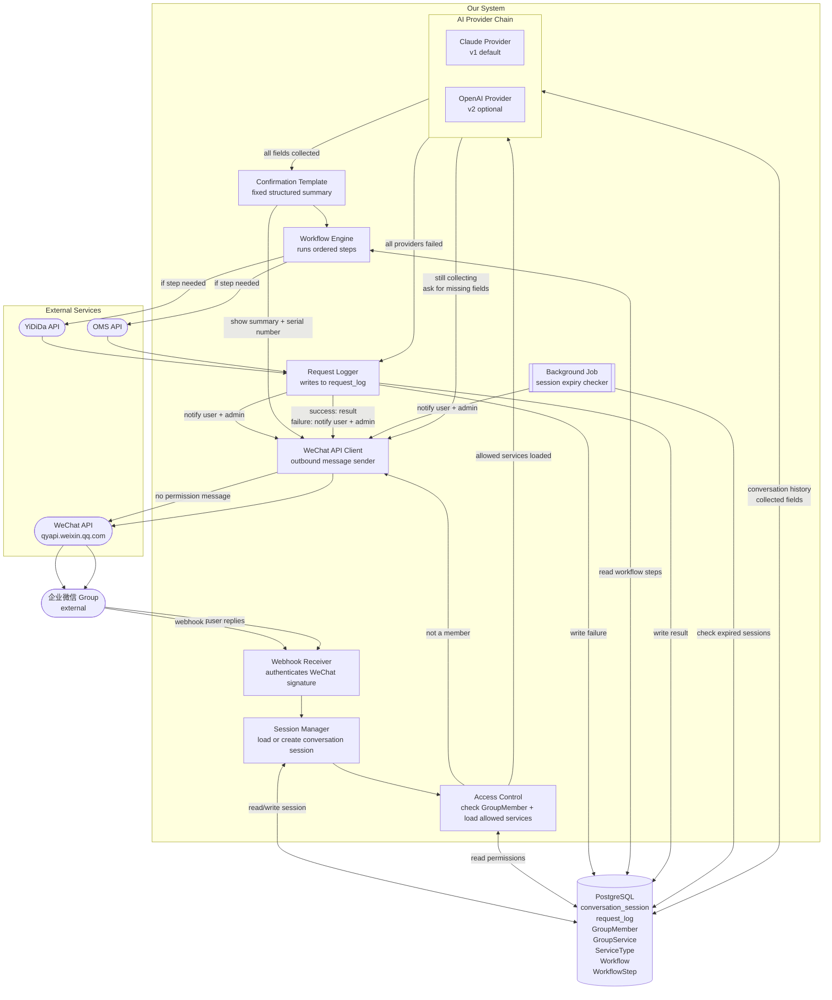

# System Architecture
# Logistics WeChat Bot Platform — v1

**Version:** 1.1
**Date:** 2026-04-26
**Status:** Draft

---

## System Flow Diagram



---

## Plain ASCII Flow (for quick reference)

```
企业微信 Group (external)
        │
        │ webhook POST
        ▼
┌─────────────────────┐
│  Webhook Receiver   │  authenticates WeChat signature (SHA1)
└────────┬────────────┘
         │
         ▼
┌─────────────────────┐
│  Session Manager    │ ◄──► Database (conversation_session)
│  load/create session│      detects session via serial number or (user, group)
└────────┬────────────┘
         │
         ▼
┌─────────────────────┐
│  Access Control     │ ◄──► Database (GroupMember, GroupService)
└──┬──────────────────┘
   │ not a member                   │ member — allowed services loaded
   ▼                                ▼
WeChat API Client         ┌──────────────────────────┐
→ no permission msg       │  AI Provider Chain        │
                          │  ┌────────────────────┐   │
                          │  │ Claude Provider    │   │  ◄──► Database
                          │  │ (v1 default)       │   │       (history, fields)
                          │  ├────────────────────┤   │
                          │  │ OpenAI Provider    │   │
                          │  │ (v2, if Claude down│   │
                          │  └────────────────────┘   │
                          └──┬───────────────┬─────────┘
                    all providers          still           all fields
                    failed                collecting       collected
                             │               │                │
                             ▼               ▼                ▼
                        Request          WeChat API     Confirmation
                        Logger           Client         Template
                             │               │                │
                        notify user    → WeChat Group   → WeChat Group
                        + admin                         user confirms "确认"
                             │                                │
                             ▼                                ▼
                        close session              ┌─────────────────────┐
                                                   │  Workflow Engine     │ ◄──► Database
                                                   └──┬──────────────────┘
                                                      │
                                          ┌───────────┴────────────┐
                                          ▼                        ▼
                                     YiDiDa API              OMS API
                                     (if needed)             (if needed)
                                          └───────────┬────────────┘
                                                      ▼
                                             ┌─────────────────────┐
                                             │  Request Logger      │ ──► Database
                                             └─────────────────────┘
                                                      │
                                                      ▼
                                              WeChat API Client
                                                      │
                                                      ▼
                                             WeChat Group
                                     (result / error + admin notification)

─ ─ ─ ─ ─ ─ ─ ─ ─ ─ ─ ─ ─ ─ ─ ─ ─ ─ ─ ─ ─ ─ ─ ─ ─ ─ ─
Background Job (runs independently on a timer)
  checks conversation_session for rows past expires_at
  → marks timed_out
  → WeChat API Client → notify user + admin in group
```

---

## Component Descriptions

| Component | Responsibility |
|---|---|
| **Webhook Receiver** | Receives all incoming WeChat webhooks. Authenticates every request by verifying WeChat's SHA1 signature before any processing. Rejects invalid requests immediately. Returns HTTP 200 acknowledgement within 1 second so WeChat does not retry. |
| **Session Manager** | Looks up existing `conversation_session` by `(wechat_openid, group_id)`. Creates a new session if none exists. Detects which active session a reply belongs to: first via serial number regex (`REQ-YYYYMMDD-NNNN`), then passes ambiguous cases to AI Provider Chain to resolve. |
| **Access Control** | Checks if the sender is in `GroupMember` for this group. If not → sends no-permission reply via WeChat API Client. If yes → loads group's allowed services from `GroupService` and passes them forward. |
| **AI Provider Chain** | Abstraction layer over all AI providers. Tries providers in order (Claude first). If a provider is unavailable, tries the next. If all fail → triggers failure path. For v1, chain contains Claude only. Adding GPT in v2 requires no changes outside this component. |
| **Claude Provider** | Calls Claude API with: user message + conversation history + allowed services + collected fields. Returns: conversational reply (ask for more info) OR normalized JSON (all fields collected). Also handles multi-session disambiguation. |
| **OpenAI Provider** | v2 placeholder. Same interface as Claude Provider. Activated if Claude is unavailable. |
| **Confirmation Template** | Fixed structured message (not AI-generated). Displays all collected and normalized fields clearly for user to verify. Includes serial number. Waits for user to reply "确认" before triggering Workflow Engine. |
| **Workflow Engine** | Loads `WorkflowStep` rows for the confirmed service type in this group. Executes steps in order. Each step is a pluggable handler. Not every workflow calls every external API — steps are configured per group. |
| **Request Logger** | Writes final request status, result, and error detail to `request_log`. Always runs — whether workflow succeeds, fails, or AI is unavailable. Single source of truth for all request history. |
| **WeChat API Client** | Dedicated outbound module. Manages WeChat access tokens (auto-refreshes every 2 hours). Sends text messages, @mentions, and file attachments (label PDFs) to groups via WeChat's API. Used by all components that need to send messages. |
| **Background Job** | Runs on a timer independently of request flow. Checks `conversation_session` for rows past `expires_at`. Marks them `timed_out`, notifies user and admin via WeChat API Client. |

---

## External Dependencies

| Service | Used for | Called by |
|---|---|---|
| **WeChat API** | Sending all outbound messages to groups (replies, notifications, PDFs) | WeChat API Client (single point of contact) |
| **Claude API** | Conversation management, field extraction, normalization, disambiguation | Claude Provider (inside AI Provider Chain) |
| **YiDiDa API** | Label creation (FedEx, UPS) | Workflow Engine — only when workflow includes label step |
| **OMS API** | Warehouse-in records, history logging | Workflow Engine — only when workflow includes OMS step |

---

## Database Tables Referenced

| Table | Read by | Written by |
|---|---|---|
| `conversation_session` | Session Manager, AI Provider Chain | Session Manager, Background Job |
| `request_log` | — | Request Logger |
| `GroupMember` | Access Control | Admin (manual setup) |
| `GroupService` | Access Control | Admin (manual setup) |
| `ServiceType` | AI Provider Chain | Admin (manual setup) |
| `Workflow` / `WorkflowStep` | Workflow Engine | Admin (manual setup) |

---

## Key Design Decisions
- ADRs to be added in separate files under `docs/decisions/`
