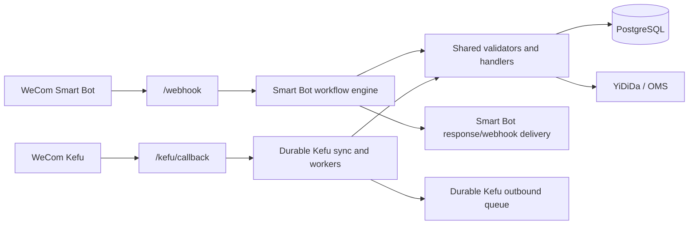

# System architecture

**Status:** Current
**Owner:** Engineering
**Last verified against commit:** `3def0eb` (2026-09-25)

The service is one FastAPI application with two independently gated WeCom
entry pipelines. Both pipelines use the same PostgreSQL domain data and shared
U-Choice handlers, but they deliberately retain different orchestration and
delivery mechanics.

## Runtime composition

- `main.py` is the composition root and owns route and scheduler wiring.
- `SMART_ROBOT_ENABLED` controls the Smart Bot webhook and its scheduled
  reports.
- `KEFU_CALLBACK_ENABLED` controls Kefu callback verification and routing.
- `KEFU_ENABLED` controls Kefu business processing and requires the callback
  mode.
- `RUN_SCHEDULER` identifies the single process allowed to run scheduled jobs.

See [Runtime modes](runtime-modes.md) for supported combinations and required
credentials.

## Shared domain layer

Both channels converge on shared validation, confirmation/result construction,
access control, service catalogs, and handler dispatch. Kefu retains its own
transaction-owning turn adapter because its durable processing and replay
requirements differ from Smart Bot's request lifecycle.

Important boundaries:

- Channel adapters may format and transport messages differently.
- Shared business rules must not depend on transport-specific identity shapes.
- Kefu must not call Smart Bot helpers that commit independently inside a Kefu
  transaction.
- Administrative role invariants count active administrators across both
  `group_member` and `kefu_staff`.
- Kefu-only features: batch completion confirmation, and voice input.
  A voice message is transcribed and persisted *before* the case processor
  (in `core/kefu_sync.run_worker_once` → `core/kefu_voice.py`), then flows
  through the same text path. The Kefu turn adapter marks it
  `input_modality: voice`: voice replies echo the transcript, and voice can
  never execute a confirmation or a system command. Smart Bot doesn't see the
  batch services (`core/access_control.KEFU_ONLY_SERVICE_NAMES`).
- `core/customer_directory.py` (customer master data, encrypted OMS/YDD
  credentials) and `core/warehouse_directory.py` (company shipping-origin
  directory) are shared subsystems both channels read from the same way.
  Role/service-assignment policy (warehouse scope, customer identity) is
  declared once in `core/role_policy.py`/`core/role_registry.py` — see
  [ADR-010](decisions/adr-010-role-service-policy-declarations.md).

## Persistence and background work

- SQLAlchemy is the runtime ORM.
- PostgreSQL is the supported persistent database.
- Schema changes are sequential SQL files in `db/migrations/`, applied by
  `scripts/apply_migrations.py`, which records applied versions in
  `public.schema_migrations` (see [Migrations](../operations/migrations.md)).
- APScheduler runs in-process. The supported deployment topology has exactly
  one scheduler-bearing process; there is no distributed leader election.

## External systems

- WeCom Smart Bot and WeCom Kefu
- Anthropic Claude and OpenAI provider chain; OpenAI transcription for Kefu voice
- YiDiDa and OMS logistics APIs
- Render web service and PostgreSQL

## Related documentation

- [Product scope](../product/overview.md)
- [Data model](data-model.md)
- [Code map](code-map.md)
- [Configuration reference](../reference/configuration.md)
- [API reference](../reference/api.md)
- [Render operations](../operations/deployment-render.md)
- [Architecture decisions](decisions/)
